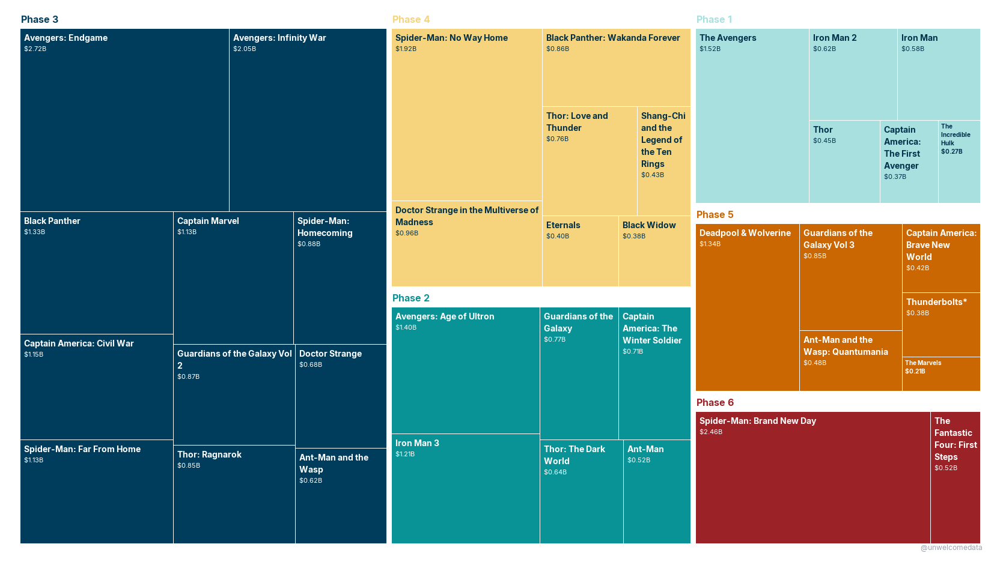
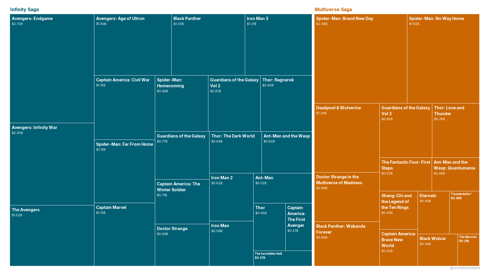
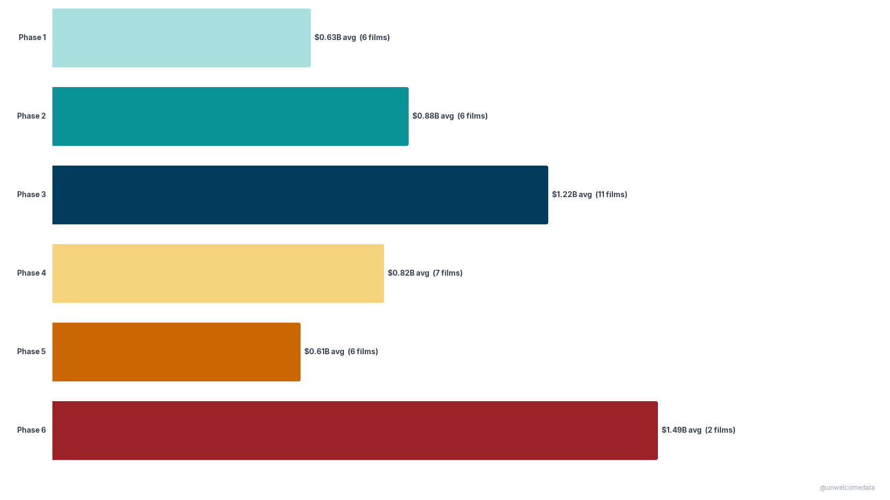
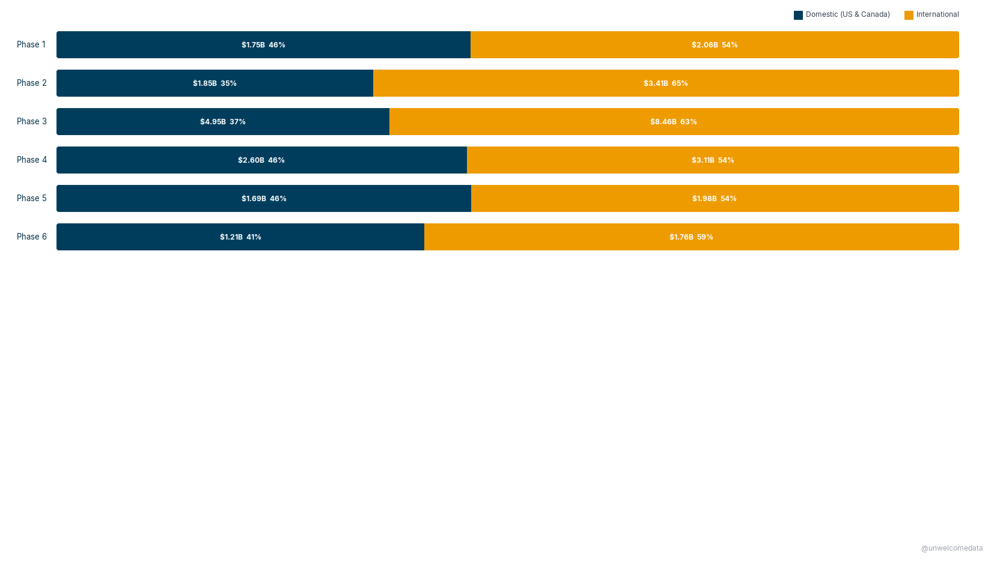

**[@unwelcomedata](https://github.com/unwelcomedata)** · data from public sources
Follow for new charts: [X](https://x.com/unwelcomedata) · [Bluesky](https://bsky.app/profile/unwelcomedata.bsky.social)

# The Marvel Cinematic Universe, by the box office

Twenty-something films, six Phases, two Sagas, **$34.8 billion** worldwide. This
is the MCU as a *part-of-whole* picture — every theatrical film sized by what it
earned, grouped by where it sits in the story — plus a couple of cuts that ask
which era actually carried the franchise.

**The findings:**
- **One Phase carries the franchise.** Phase 3 (2016–2019: *Civil War* through
  *Far From Home*, with *Infinity War* and *Endgame*) is **~38% of all MCU box
  office** — 11 films, $13.4B, more than Phases 1 and 2 combined.
- **The finished Saga still outweighs the ongoing one.** The Infinity Saga
  (Phases 1–3) is **64.5%** of the total; the entire Multiverse Saga so far
  (Phases 4–6) is **35.5%** — even though it has been running for years.
- **Volume isn't the whole story.** Correcting for how many films each Phase has,
  the *average* film earned most in Phase 6 ($1.49B, but only two films so far)
  and Phase 3 ($1.22B) — while Phase 5 films averaged the least ($0.61B).
- **The MCU earns most of its money abroad**, and always has — international box
  office is the majority share in every Phase.

---

_Click any chart to open it at full resolution._

## 1. The whole franchise, film by film

Every released theatrical MCU film as a tile sized by its **lifetime worldwide
gross**, grouped and colored by Phase (cool blues = the Infinity Saga, Phases 1–3;
warm golds/red = the Multiverse Saga, Phases 4–6). The giant tiles — *Endgame*
($2.72B), *Brand New Day* ($2.46B), *Infinity War* ($2.05B), *No Way Home* ($1.92B)
— are the franchise's tentpoles; Phase 3's block dwarfs the rest.

## 2. Infinity Saga vs. Multiverse Saga

The same films, colored by **Saga**. The finished three-Phase Infinity Saga (teal)
still takes up almost two-thirds of the picture; everything since *Endgame* (the
Multiverse Saga, orange) is the smaller block.

## 3. Average box office per film, by Phase

Total gross rewards Phases that simply had more films, so this is the fairer
comparison: the **average lifetime worldwide gross per film** in each Phase (film
counts shown in each bar). Phase 3 both had the most films *and* averaged high.
Phase 6's chart-topping average rests on just two films, and its figure is **as of
September 2026** — *Spider-Man: Brand New Day* was still in theaters, so it will
keep rising.

## 4. Where the money comes from — home vs. abroad

Each Phase's worldwide gross split into **domestic (U.S. & Canada)** vs.
**international**, normalized to 100% so the *mix* is comparable (dollar amounts
shown inside each segment). International is the majority in every Phase; the
foreign share peaks in the mid-Phases (*Iron Man 3* / *Ultron* era) then eases back.

---

## How it's measured

- **Scope:** released **theatrical** MCU feature films only — Marvel Studios'
  Phase 1–6 canon, *Iron Man* (2008) through *Spider-Man: Brand New Day* (2026),
  including the Sony-distributed Tom Holland *Spider-Man* films (they're MCU-canon
  and both trackers file them under the franchise). No Disney+ series, no TV
  specials, no unreleased/future films.
- **Grosses are nominal** (year-of-release dollars), *not* inflation-adjusted —
  this project is about each film's share of the franchise, not cross-era ranking,
  so no adjustment is applied.
- **Snapshot as of 2026-09-19.** Films still in theaters (*Brand New Day*) have
  lifetime totals that will keep climbing; treat those as lower bounds.

## The data

The published dataset is in [`export/`](export/) with a codebook describing every
column:

- `mcu_box_office_v1.csv` — one row per film: worldwide / domestic / international
  gross, Phase, Saga, share of franchise / Saga / Phase, opening weekend, budget.

## Sources & license

Box-office figures are cited from **[The Numbers](https://www.the-numbers.com/movies/franchise/Marvel-Cinematic-Universe)**
(per-film domestic + worldwide gross) and **cross-checked against Box Office Mojo** —
the two independent trackers agree on domestic gross to within ~1.4%. Phase/Saga
groupings are Marvel Studios' official designations. Full attribution and caveats
in [SOURCES.md](SOURCES.md). These are publicly reported box-office facts,
transformed into new metrics and attributed here — not a redistribution of any
provider's dataset.

---

> **AI-Assisted Development**
> This project was built with the assistance of [Kiro](https://kiro.dev), an
> AI-powered development environment. All data-sourcing decisions, methodology
> choices, and published findings are the responsibility of the author. AI was
> used for code generation, data-pipeline construction, and research assistance —
> not for analysis conclusions or editorial judgment.
